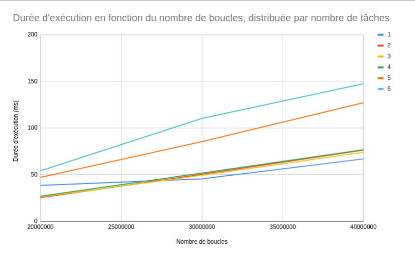

# Informatique Temps Réel (ITR)

Travaux dirigés pour le cours _Informatique temps Réel_.

## TD1

### a) Gestion simplifiée du temps Posix

Les fonctions utilitaires de gestion du temps sont définies dans `libtime.h` et implémentées dans `libtime.cc`.
Pour chaque timestamp manipulé, on vérifie que `tv_nsec` est entre 0 et 1000000000 (exclu).

On teste ces fonctions avec des tests unitaires dans `qa.cc`.
Si l'exécutable n'affiche rien, c'est que tous les tests passent.

### b) Timers avec callback

Le fichier `qb.cc` implémente un timer en suivant l'exemple du cours.

### c) Fonction simple consommant du CPU

Le fichier `qc.cc` implémente une fonction simple incrémentant un compteur sur un nombre de boucles défini par l'utilisateur.

On exécute cette fonction avec 1,000,000,000 boucles:
```
./td1/qc 1000000000
```

On obtient le résultat suivant:
```
1000000000.000000 in 1.253268 seconds
```

### d) Mesure du temps d’exécution d’une fonction

Le fichier `4d.cc` propose une modélisation affine du nombre de boucles de la fonction de l'exercice précédent par rapport à son temps d'exécution.

Dans un premier temps, on mesure le nombre de boucles calculées pendant un interval de temps donné, en interrompant la fonction `incr` lorsqu'un timer arrive à échéance. Pour celà, on utilise une varaible booléenne `stop` qui est modifiée par le timer et lue par `incr`.
Il faut déclarer `stop` comme _volatile_, car celui-ci est modifié par un autre thread.

L'exécution de cette fonction pour 4 secondes donne le nombre d'incréments suivants:

```
3237265763.000000 in 4.000191 seconds
```

Dans un second temps, on calibre les paramètres du modèle affine en effectuant deux mesures du nombre de boucle pour deux durées différentes.

On obtient les résultats suivants:

```
a: 3.53056e+08
b: 5.76607e+07
Estimated loop number: 3588223232
Real loop number: 3728146160
Model error: 3.75315%
```

Note: la calibration rate parfois, probablement à cause d'autres programmes tournant sur la machine. Il est donc possible qu'une nouvelle éxecution du programme donne une erreur de modèle de plus de 50%.

### e) Amélioration des mesures

Cet exercice a été mis de côté d'après les consignes reçues en cours.

## TD2

### a) Exécution sur plusieurs tâches sans mutex

En executant la fonction plusieurs fois avec le même paramètre, on obtient parfois le mauvais résultat:

```
final counter value: 9900.000000
100 100 8.644800

final counter value: 10000.000000
100 100 9.683000

final counter value: 99962.000000
100 1000 115.854600
```

Ceci est dû aux accès en concurrence. Deux threads ou plus peuvent essayer de modifier en même temps la variable. Seules les modifications de l'un d'entre eux sont alors réellement sauvegardées.

### b) Mesure de temps d’exécution

On exécute la mesure du temps d'exécution pour différents nombres de tâche et différents nombres de boucles:



Sur un OS temps réel, on constate que le nombre de tâche reflète le nombre de coeurs: 
Tant que le nombre de tâches est en dessous du nombre de coeur, le temps d'exécution n'augmente quasiment pas. En revanche, quand on dépasse le nombre de coeurs, on a un bond brusque.

### c) Exécution sur plusieurs tâches avec mutex

On exécute la fonction précédente d'abord sans, puis avec protection par le mutex.

`./qc 100000 10 3 1`

```
final counter value: 426251.000000
100000 10 2.116700

final counter value: 276000.000000
100000 10 2.333200

final counter value: 310632.000000
100000 10 1.762000
```

`./qc 100000 10 3 1`

```
final counter value: 1000000.000000
100000 10 3.836700

final counter value: 1000000.000000
100000 10 6.062500

final counter value: 1000000.000000
100000 10 4.057500
```

On remarque qu'utiliser les mutex permet d'éviter les accès en concurrence. Le résultat est alors stable (le `counter` a toujours la valeur attendue). 
Cependant l'execution prend plus de temps.

## TD3

### a) Classe Chrono

La class Chrono est implémentée principalement en utilisant les fonctions temporelles utilitaires définies au TD1 a).

On teste le chrono en exécutant `./td3/qa`:

```
0.009000 ms
2966.792600 ms
2966.914551 ms
```

### b) Classe Timer

La classe abstraite `Timer` utilise implémente la logique temporelle du timer à l'aide des fonctions Posix. Cependant, elle n'implémente pas la logique concernant l'action à réaliser lorsque le timer arrive à échéance. Pour l'implémenter, il faut créer une nouvelle classe héritant de `Timer` et implémentant la méthode virtuelle `callback`.
Cette méthode est appelée via une référence à l'objet lui-même dans la fonction `call_callback`. Cette référence est passée comme `sigev_value.sival_ptr` lors de la création du `Timer`. Elle est donc passée en argument de `call_callback`, qui est l'action `sa_sigaction` réalisée à l'échéance du Timer.

On implémente une classe `PeriodicTimer`, qui permet d'exécuter la `callback` périodiquement.

Enfin, on implémente un `CountDown` pour tester les deux classes précédentes. On lui demande de compter de 9 à 0.
On peut le tester avec `./td3/qb`:

```
9
8
7
6
5
4
3
2
1
0
```

### c) Calibration en temps d’une boucle

Dans cet exercice, on utilise les classes définies précédemment pour reproduire la calibration du modèle affine présenté au TD1 d).

On calibre en lançant `./td3/qc` et on obtient:
`expected time: 2000.000000 ms, got : 1989.029306 ms`


## TD4

### a) Classe Thread

```
Policy 0 - priority 0
Before start - start 0 - stop 0 - exec 0
After start - start 1.58498e+12 - stop 0 - exec -1.58498e+12
When finished - start 1.58498e+12 - stop 1.58498e+12 - exec 2791
Result 1e+09
```

### b) Classes Mutex

### c) Classe Semaphore

### d) Classe Fifo

## TD6

Les classes `ActiveObjects` et `Requests` implémentent de manière générale le pattern d'objet actif.

`Requête` est un object abstrait représentant une requête. Il propose une méthode pour attendre le résultat, à l'aide d'un sémaphore. La méthode `execute`, executant le calcul, est virtuelle. En effet, son implémentation est spécifique à chaque cas. Il faut penser à libérer le sémaphore avec `semaphore.give()` dans l'implémentation de cette méthode.

`ActiveObject` est un thread possédant une file de requêtes. Sa boucle principale consiste à extraite les requêtes de la file et les exécuter une par une.

Les classes `ActiveCalc` et `CrunchReq` héritent des classes précédentes pour implémenter le pattern objet actif dans le cas particulier du calculateur.

`Calculator` est la classe exécutant le calcul en lui-même. Pour simuler la charge du calcul, on fait dormir le thread en utilisant `Thread::sleep_ms(param)`, où `param` est la valeur passée au calculateur.

`ActiveCalc` prend en argument de constructeur une référence vers un `Calculator` afin de créer une nouvelle requête `CrunchReq` qu'il empile dans sa pile.

Enfin, la classe `Client` représente un client qui demande l'exécution d'un calcul auprès d'un `ActiveCalc`. Son constructeur prend le paramètre du calcul ainsi que la référence vers le `ActiveCalc` à solliciter.

Le fichier `main` met en oeuvre le calcul en asynchrone de requêtes demandées par 10 clients différents.

Pour tester l'ensemble, lancer la commande `./td6/active`:

```
Client 2 result 4
Client 4 result 8
Client 16 result 32
Client 8 result 16
Client 32 result 64
Client 128 result 256
Client 64 result 128
Client 256 result 512
Client 1024 result 2048
Client 512 result 1024
```